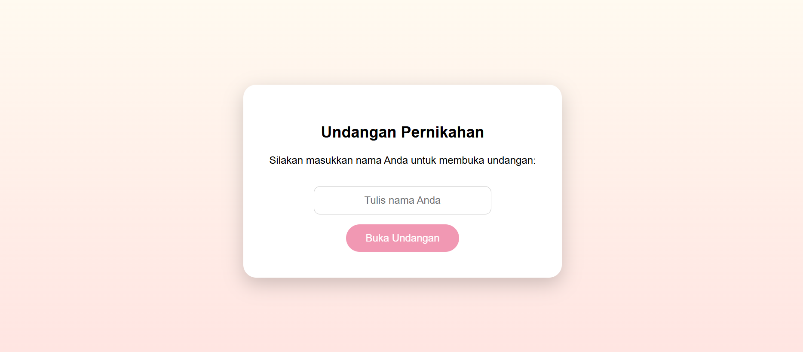
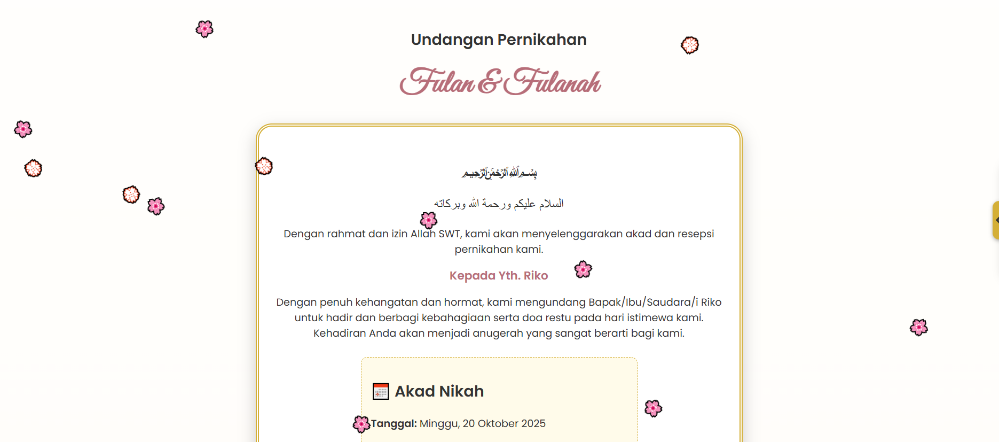
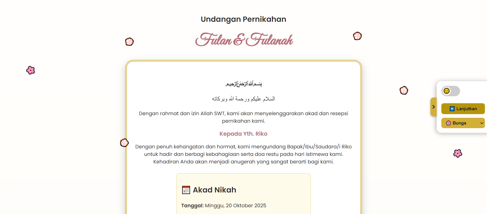

# 📌 Undangan Digital  

Tampilan antarmuka aplikasi **UndanganDigital**.  
Berikut beberapa screenshot fitur utama:  

---

## 🔑 Tamu Undangan, Tampilan Utama
<table>
  <tr>
    <td align="center"><b>Tamu Undangan</b></td>
    <td align="center"><b>Tampilan Utama</b></td>
  </tr>
  <tr>
    <td></td>
    <td></td>
    <td></td>
  </tr>
</table>

---

## 📋 Daftar & 🔑 Lupa Password
<table>
  <tr>
    <td align="center"><b>Daftar</b></td>
    <td align="center"><b>Daftar (Step 2)</b></td>
    <td align="center"><b>Lupa Password</b></td>
  </tr>
  <tr>
    <td></td>
    <td></td>
    <td></td>
  </tr>
</table>